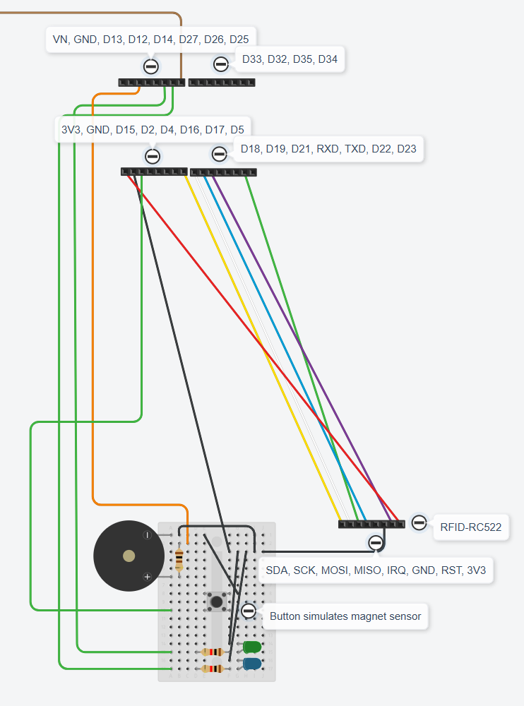

# ESP32 WROOM 32D - RFID and door sensor module

RFID and door sensor module is complete on breadboards.

## ESP32 WROOM 32D board is visualized as four 8-pin headers in the sketch.
 - D25 is used to send a signal to the display and switch module to open the door. This is the brown wire going out of the sketch into D33 of the other ESP WROOM 32D board.
 - D13 is the orange wire going to through a 100Ω resistor to the + input of the buzzer.
 - D26 is the green wire going through a 1kΩ resistor to the blue LED. This LED is blinking 1s on and 3s off to indicate the the RFID sensor is alive.
 - D27 is the green wire going through a 1kΩ resistor to the green LED. This LED turns on for 1s when a valid RFID card is presented to indicate that access to the door is granted.
 - D15 is the green wire going to the magnet sensor's + pin. It's simulated with a push button in this Tinkercad sketch.

## RFID-RC522 module is visualized as an 8-pin header in the sketch.
 - SDA is the yellow wire connected to the ESP32 pin D5
 - SCK is the white wire connected to the ESP32 pin D18
 - MOSI is the green wire connected to the ESP32 pin D22
 - MISO is the blue wire connected to the ESP32 pin D19
 - IRQ is not connected
 - GND is the black wire connected to ESP32 GND pin through the breadboard
 - RST is the purple wire connected to ESP32 pin D21
 - 3V3 is the red wire connected to ESP32 3V3 output