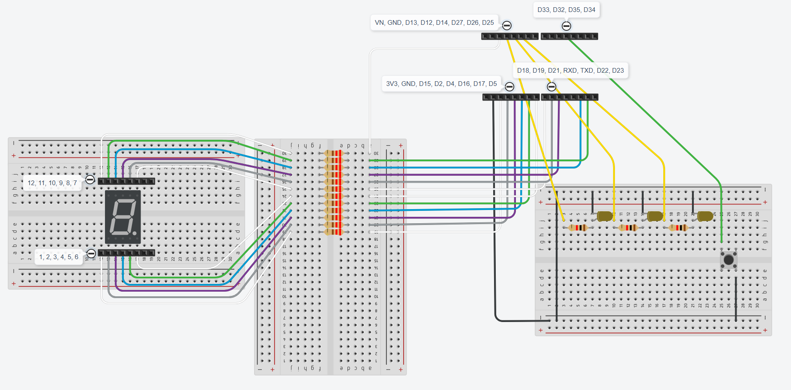

# ESP32 WROOM 32D - switch and display module

Switch and display module is almost complete on breadboards. The only thing left is the [VO617A Optocoupler](https://mou.sr/45uYfCM), which is going to monitor the emergency stop button on the original Windsor control unit.

## ESP32 WROOM 32D board is visualized as four 8-pin headers in the sketch.
 - D32 is used to receive a signal from the [VO617A Optocoupler](https://mou.sr/45uYfCM), but still simulated by a regular pushbutton. This is the green wire.
 - D33 is used to receive a signal from the RFID and door sensor module to open the door. This is the brown wire going out of the sketch into D25 of the other ESP WROOM 32D board.
 - D25 is the yellow wire going through a 1kΩ resistor to the Base (B, left pin) of the [TIP120 Darlington Transistor](https://mou.sr/4l0KVe1)
 - D26 is the green wire going to the push button used to select which value to display (day/week/month)
 - D27 is the yellow wire going through a 1kΩ resistor to the yellow LED representing month view
 - D14 is the yellow wire going through a 1kΩ resistor to the yellow LED representing week view
 - D12 is the yellow wire going through a 1kΩ resistor to the yellow LED representing day view

 ## 4 digits 7 segments display
 The 4 digits display is visualized as a single digit in this Tinkercad sketch.
 
 All wires connected to the 4 digits 7 segments display are going through 220Ω resistors, one for each pin. They are all connected to the ESP32 module according to the following pin mapping:
  |ESP32 pin|Wire color|Display pin|
 |--|--|--|
 |D13|white|12|
 |D23|green|11|
 |D22|blue|10|
 |D21|purple|9|
 |D19|gray|8|
 |D18|white|7|
 |D5|white|6|
 |D17|green|5|
 |D16|blue|4|
 |D4|purple|3|
 |D2|gray|2|
 |D15|white|1|
